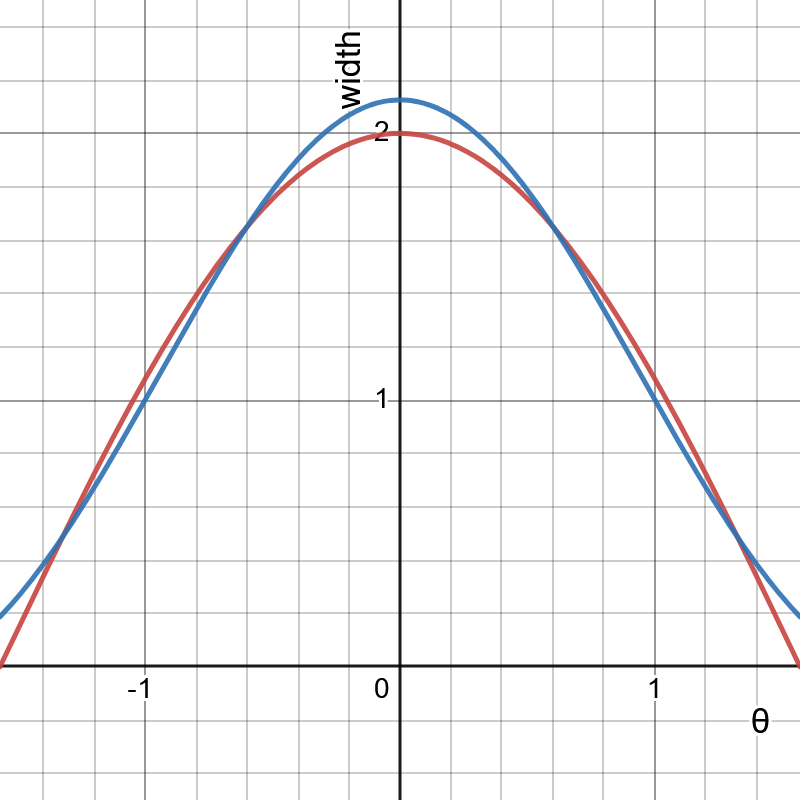

# Screen Space Refractions 

Testing ground for creating fast and relatively accurate screen space refractions. Currently only Windows is supported

Heavily based on the code from "Vulkan with C++" tutorial series: https://github.com/amengede/getIntoGameDev

# Spherical Harmonics
## Width of a unit sphere

**Red** plot is true width of a unit sphere, while **blue** one is calculated using first 9 terms of spherical harmonics expansion series.

# Short Term TODO list

- [X] Add simple camera control
- [ ] Add proper camera control (with mouse and everything)
- [X] Fix horizontal stretching of a cubemap
- [X] Fix camera's chaotic movement at the poles and close to the object
- [ ] Fix problems with weird camera related to cross product with upwards vector
- [X] Pass aspect ratio to shader as a parameter
- [ ] Implement dynamic viewport and scissor
- [X] Create separate `descriptorSetLayoutData` for each pipeline
- [ ] Create a **normal** `Pipeline` class and put `descriptorSetLayoutData` in there
  - [ ] For starters, it may be put into `vkInit::PipelineBuilder` class
- [X] Make common definitions of uniform data for shaders and C++ (`RenderParams`, for example)
- [ ] Fix that weird switching between Y- and Z-coordinates
- [X] Add analytical ray traced refractions with simple geometric shapes
  - [X] Sphere
  - [X] Cylinder
  - [X] Box
- [X] Fix window resizing
- [ ] Add ImGUI support
- [ ] Make an in-app slider for comparing different methods
- [ ] Create a **proper** `Scene` class to group models in code
- [ ] Make hot reload of shaders
- [X] Do refractions and reflections with Fresnel coefficients
- [X] Do ***proper*** refractions and reflections with Fresnel coefficients
- [X] Start with spherical harmonics on sphere before raytracing
  - http://holger.dammertz.org/stuff/notes_HammersleyOnHemisphere.html
- [X] Solve the problem with black hole in the middle of the object when calculating even number of refractions with SDF (hopefully, this just wouldn't be a problem when I implement proper ray tracing, in which case I wouldn't have to do anything)
- [X] Make `sh_distance` in `sky_shader_refraction.frag` $\varphi$-dependent. Also, rename that shader already
- [ ] Add a slider for number of points in Hammersley point set
- [ ] Move common code out of `SwapChainFrame::makeDescriptorResources()` into a separate function
- [ ] **!!! FIX THAT VERY UGLY THING WITH SH TERMS UNIFORM BUFFER !!!**
